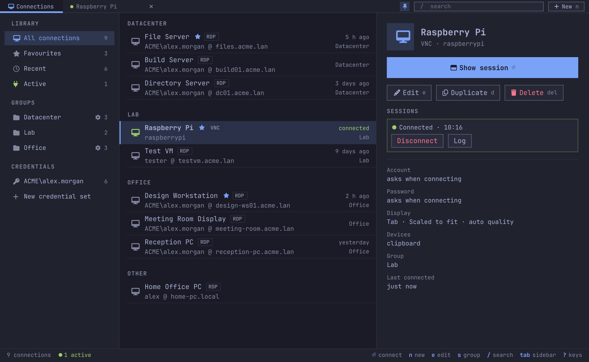
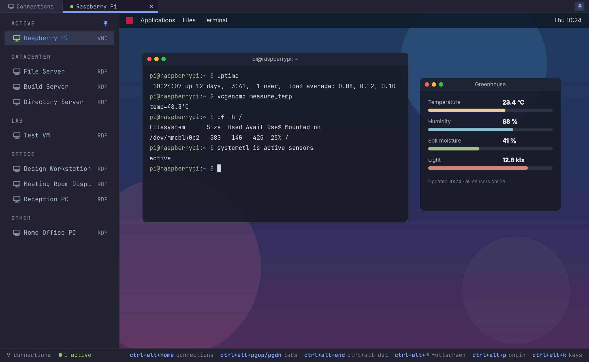
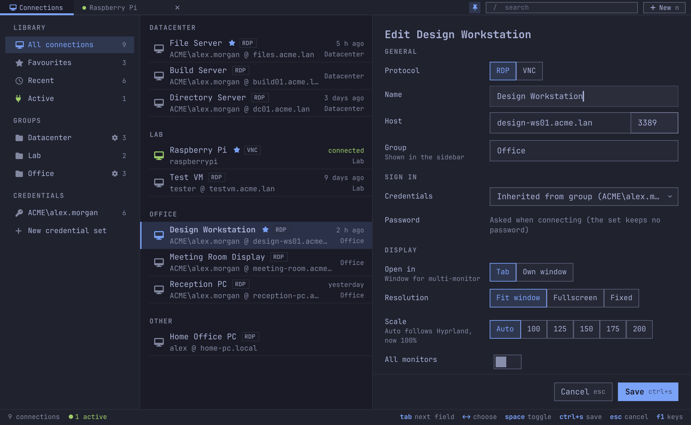
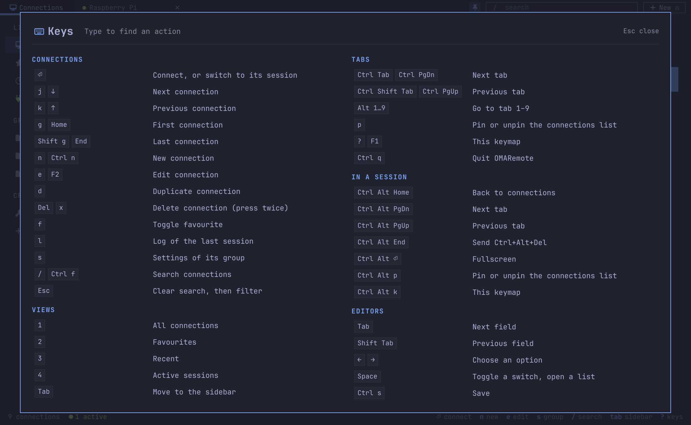

# OMARemote

A keyboard-first remote desktop client for [Omarchy](https://omarchy.org), styled after
[Flea](https://github.com/thisisgm/flea): a Quickshell UI built from Omarchy's own shell components
(`/usr/share/omarchy/shell/Commons` and `Ui`), so it follows your theme, live.



- **RDP** through FreeRDP and **VNC** through libvncclient.
- **Sessions in tabs** inside the app, or (RDP) in their own window for multi-monitor; pin the
  connections list beside them and the remote desktop resizes to fit.
- **HiDPI scaling** that follows Hyprland: the remote desktop matches the tab's size and your scale.
- **Credential sets** shared between hosts, and **group settings** that connections inherit.
- **Fast Kerberos** on networks with many domain controllers.
- **Keyboard-driven**, with a keymap sheet on `?`; the mouse works everywhere too.
- Passwords optional, in your keyring; sessions survive closing the window.

## Screenshots

A VNC session in a tab, with the connections list pinned beside it; the desktop resizes to the room
left:



| Editing a connection; its credentials come from its group | Every key, on `?` |
| --- | --- |
|  |  |

The screenshots use made-up sample data and a mock desktop.

## Install

> **Alpha.** OMARemote is in alpha (0.1.5-alpha): it works day to day, but expect rough edges.

### From a release (recommended)

Each [release](https://github.com/RFdeGroot/OMARemote/releases) has ready-built Arch packages for
Intel/AMD (`x86_64`) and for Omarchy on Apple Silicon (`aarch64`, Arch Linux ARM). These commands
download the newest one for your machine, and pacman installs it together with everything it needs:

```bash
url=$(curl -s https://api.github.com/repos/RFdeGroot/OMARemote/releases | grep -o "https://[^\"]*-$(uname -m)\.pkg\.tar\.zst" | head -1)
curl -LO "$url"
sudo pacman -U "./${url##*/}"
omaremote                    # or "OMARemote" from the launcher
```

(The first line asks GitHub for the newest release, alphas included; you can also download a
package from the [releases page](https://github.com/RFdeGroot/OMARemote/releases) by hand.)

Release packages are not signed yet. pacman installs an unsigned package from a file on disk, but
refuses one straight from a URL (`failed retrieving file '….pkg.tar.zst.sig'`), hence the download.

#### Updating

From 0.1.5-alpha on, OMARemote updates itself:

1. At startup it asks GitHub once whether there is a newer release with a package for your machine.
2. If there is, an **Update to …** button appears at the bottom of the sidebar, above the version
   you run (also reachable with the keyboard: `tab` to the sidebar, then down to the button).
3. Clicking it opens a floating terminal that downloads the package and installs it with
   `sudo pacman -U` (type your password there), then restarts OMARemote on the new version.
   Running sessions keep going and come back as tabs.

The button runs `omaremote-update`, which you can also run yourself in a terminal, any time:

```bash
omaremote-update             # install the newest release for this machine, restart OMARemote
omaremote --version          # the version you have
```

Updating by hand works too: run the install commands above again, and pacman upgrades OMARemote in
place; then close it with `super+w` and open it again. Each release's notes say what changed; to
hear about new ones, use *Watch → Custom → Releases* on the GitHub page.

**Turning the startup check off.** The check is one request to `api.github.com` when OMARemote
starts. To skip it, set `OMAREMOTE_NO_UPDATE_CHECK=1` in the environment Omarchy gives your apps,
then log out and back in:

```bash
mkdir -p ~/.config/environment.d
echo 'OMAREMOTE_NO_UPDATE_CHECK=1' > ~/.config/environment.d/omaremote.conf
```

For a single run, start it as `OMAREMOTE_NO_UPDATE_CHECK=1 omaremote` instead. Remove the file
(and log in again) to turn the check back on; `omaremote-update` works either way.

A checkout (see below) shows `(dev)` after the version and never offers the button; it only
mentions that a newer release exists. Update a checkout with `git pull && ./install.sh`.

#### Building from source

To build the package yourself instead, take the newest release's `PKGBUILD`:

```bash
mkdir omaremote && cd omaremote
curl -LO "$(curl -s https://api.github.com/repos/RFdeGroot/OMARemote/releases | grep -o 'https://[^"]*/PKGBUILD' | head -1)"
makepkg -si                  # installs the build tools and dependencies, builds, installs
```

#### Removing

`sudo pacman -R omaremote`. Your connections stay in `~/.config/omaremote`, and saved passwords in
the keyring.

### From a checkout (development)

```bash
git clone https://github.com/RFdeGroot/OMARemote.git && cd OMARemote
./install.sh                 # checks dependencies, builds the tab renderers, links into ~/.local
omaremote                    # or "OMARemote" from the launcher
```

Update a checkout with `git pull && ./install.sh` (it rebuilds the tab renderers), then restart
OMARemote.

Keep to one of the two: with both, which one runs depends on the order of your `PATH`. Run
`./install.sh --uninstall` before installing a release, and `sudo pacman -R omaremote` before
going back to a checkout.

The installer checks everything first and lists what is missing, grouped by what needs it, with
the packages to install:

| For | Needs (Arch package) |
| --- | --- |
| the app | `quickshell`, `python`, `libsecret`, `hyprland`, Omarchy's shell |
| building the tab renderers | `cmake`, `ninja`, `gcc`, `pkgconf`, `qt6-declarative` |
| RDP | `freerdp` (3.x) |
| VNC | `libvncserver` (for libvncclient) |
| optional | `libnotify` (a notification when a session fails) |

`./install.sh --install-deps` installs the missing packages with pacman (it asks first),
`./install.sh --check` only checks, and `./install.sh --uninstall` removes the links (your
connections stay in `~/.config/omaremote`).

## Use

Everything works from the keyboard. Press **`?`** (or **F1**; **Ctrl+Alt+K** inside a session) for
the keymap sheet with every binding, grouped. Type to filter it and press ⏎ to run the highlighted
action. The status bar always shows the keys for where you are.

The most used:

| Key | Action |
| --- | --- |
| `⏎` | connect, or switch to the connection's running session |
| `j` `k` / arrows | move through the list |
| `n` / `e` / `d` | new / edit / duplicate connection |
| `del` `del` | delete (press twice) |
| `f` | toggle favourite |
| `s` | settings of the connection's group |
| `c` | new credential set |
| `l` | log of the last session (`w` warnings only, `esc` close) |
| `/` | search |
| `1`–`4` | All, Favourites, Recent, Active |
| `tab` | move to the sidebar (`j` `k`, `⏎` open, `s` group settings, `esc` back) |
| `ctrl+tab`, `alt+1`–`9` | switch tabs |
| `p` | pin the connections list beside session tabs |
| `ctrl+s` / `esc` | save / cancel in an editor; `tab` walks every field |

Inside a session every key goes to the remote desktop, except these:

| Key | Action |
| --- | --- |
| `ctrl+alt+home` | back to the connections tab |
| `ctrl+alt+pgup` / `pgdn` | previous / next tab |
| `ctrl+alt+end` | send ctrl+alt+del |
| `ctrl+alt+⏎` | fullscreen, chrome hidden |
| `ctrl+alt+p` | pin or unpin the connections list |
| `ctrl+alt+k` | keymap sheet |

**Pinning** (`p`, `ctrl+alt+p` or the pin in the tab strip) docks the connections on the left of
every session tab, in the sidebar's style: running sessions under *Active*, the rest under their
groups, always all of them whatever the connections tab is searching. The session gives up that
width, and a desktop that follows its tab resizes to the room left; unpin and it grows back to the
full width. Click a running connection to switch to it, double-click any to connect. The choice is
remembered.

Closing a tab disconnects (a Windows session stays logged in). Closing the app does not: sessions
keep running and come back as tabs when it opens again.

From a keybinding or script: `omaremote open "Work PC"` shows that connection in OMARemote (its
running session, or a new one in a tab, starting OMARemote if needed); `omaremote connect "Work PC"`
connects without the window. Both take a connection's id, name or host.

**In the Omarchy bar:** the [OMARemote plugin](https://github.com/RFdeGroot/omarchy-omaremote) lists
running sessions and favourite connections, a click away
(`omarchy plugin add https://github.com/RFdeGroot/omarchy-omaremote.git --enable`).

## Credentials and groups

- **All connections** lists them under their group headings once any group exists, favourites first
  within each group, and those without a group under OTHER. A search, and the other views, list
  them flat.
- **Credential sets** (sidebar, CREDENTIALS) hold a user name, domain and optionally a password
  (in the keyring) that any number of connections can use.
- **Group settings**: right-click a group, click its gear, or press `s`. A group can name a
  credential set and set any connection setting; a setting left at — is up to each connection.
  *Apply* makes the group's connections follow it now (their own values for those settings go, and
  they inherit its credentials).
- A connection's **Credentials** dropdown: *Inherited from group* (the default in a group that has
  credentials), any credential set, *Specify below* (user, domain, password, *Save credentials*),
  or *New credential set…*.
- A connection is built as defaults → group settings → its own values, and stores only what differs
  from what it inherits; settings that come from the group are marked "· group" in the editor.

## RDP

### Scaling

- **Fit window** (default) sends resolution updates as the tab or window resizes, so the remote
  desktop always matches it, at native pixels.
- **Scale → Auto** uses Hyprland's scale for the focused monitor (`hyprctl monitors`) and sends it
  to Windows as the desktop scale plus the nearest device scale (100/140/180). Pinning a value
  (100–200) overrides it.
- **Fixed** asks for a set resolution and scales the picture to fit.
- **Open in: Own window** runs `sdl-freerdp3` instead of a tab, which also covers *All monitors*.

### Kerberos

MIT Kerberos (what FreeRDP uses on Linux) tries every domain controller the realm lists in DNS,
one at a time, waiting a second for each UDP attempt before falling back to TCP. With dozens of
DCs behind a VPN that drops UDP, a sign-in can take a minute or more. Windows avoids this by
locating a DC in its own site.

OMARemote does the equivalent at connect time: it looks up `_kerberos._tcp.<realm>`, tries all
KDCs in parallel over TCP, and keeps the three fastest (cached for 6 hours in
`~/.cache/omaremote/`, re-probed if they stop answering). FreeRDP gets a private krb5.conf with
just those, TCP only, through `KRB5_CONFIG`. `/etc/krb5.conf` is never touched.

- The realm comes from the connection's domain when it is a DNS name (`acme.lan`), otherwise from
  the host's DNS suffix. A NetBIOS domain (`acme`) that matches the host's DNS domain is signed in
  as that DNS domain (`acme.lan`), so Kerberos still works; NTLM accepts either.
- **Kerberos KDC** in the editor pins specific DCs and skips discovery.
- The session card shows whether the sign-in used Kerberos or NTLM.

## VNC

Pick **VNC** as a connection's protocol (port 5900 by default). VNC sessions always open in a tab.
They sign in with a VNC password, or a user name and password for servers that ask for one
(VeNCrypt, Apple Remote Desktop); either can come from a credential set or be asked inside the tab.

- **Scaling**: *Fit window* scales the remote screen to the tab, *Native pixels* shows it pixel for
  pixel, *Resize remote* asks the server to match the tab's size (servers with ExtendedDesktopSize,
  such as TigerVNC, wayvnc and libvncserver-based ones).
- **Quality**: *Auto* (Tight with JPEG), *High* (lossless ZRLE), *Low* (strong compression).
- **View only** watches without sending keyboard or mouse input.
- Clipboard text goes both ways (UTF-8 where the server supports it), and the server's cursor is
  drawn locally. Keys are sent as X keysyms, so the server's own keyboard layout applies.

## How it works

```
ui/                      Quickshell UI (boot/shell.qml is the entry; Commons/Ui link to Omarchy's shell)
bin/omaremote            launcher: opens the UI, or `connect <name>`
bin/omaremote-session    backend: session settings, keyring, Kerberos discovery, session supervisor
native/rdp/              omaremote-rdp: an RDP session for a tab (libfreerdp)
native/vnc/              omaremote-vnc: a VNC session for a tab (libvncclient)
native/common/           the link both share with the UI
native/plugin/           RdpView, the Qt Quick item that shows a session in a tab
```

**Tabs.** Wayland has no way to embed another program's window, so the app draws sessions itself.
Each session is its own process, so one crashing never takes the window or other tabs with it:

- libfreerdp or libvncclient renders into a shared-memory framebuffer (memfd);
- the UI attaches over a Unix socket in `$XDG_RUNTIME_DIR/omaremote/sessions/`, receives that
  framebuffer as a file descriptor plus damage rectangles, and sends input back: keys (scancodes
  for RDP, keysyms for VNC), mouse, wheel, text clipboard, and resizes with the HiDPI scale;
- certificate and credential questions are asked inside the tab.

**Sessions** run under a detached supervisor, so closing the window keeps them open. State and logs
live in `$XDG_RUNTIME_DIR/omaremote/sessions/`; RDP sessions in their own window have the Wayland
app id `omaremote-session`, for Hyprland window rules.

**Data.** Connections, credential sets, group settings and whether the list is pinned live in
`~/.config/omaremote/connections.json`. Passwords are optional and live in the keyring
(`secret-tool`, attributes `application=omaremote` plus `connection=<id>` or `credential=<id>`).
They reach the session process over stdin, never on the command line.

**Keys** come from one table, `ui/Keymap.qml`, which both handles them and draws the keymap sheet.

## Tests

```bash
python3 -m unittest discover tests
```

## Contributing

OMARemote is meant to grow into a community project, and to become the remote desktop client for
Omarchy. Try it and tell me what breaks or what is missing: [open an
issue](https://github.com/RFdeGroot/OMARemote/issues/new/choose) for a bug or a feature request,
or send a pull request. [CONTRIBUTING.md](CONTRIBUTING.md) explains how to report a bug, how the
code is laid out, and what a pull request needs.

## License

MIT, see [LICENSE](LICENSE).
